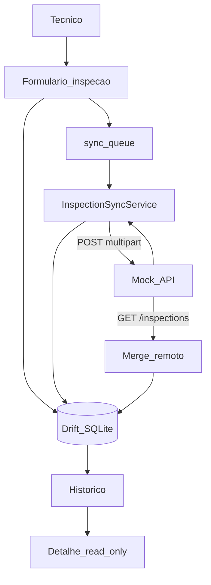
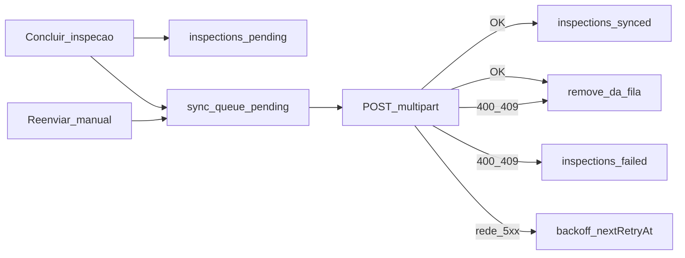
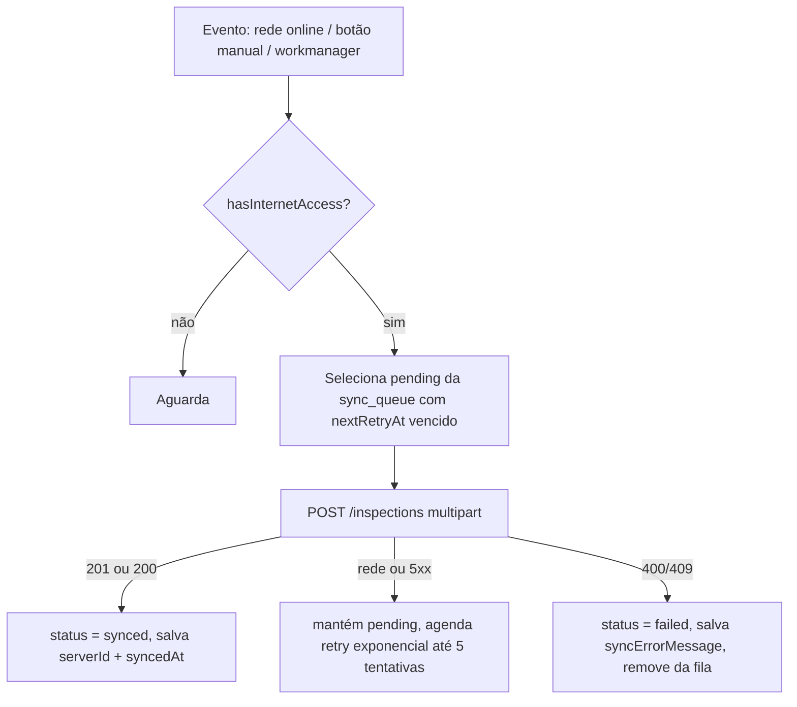

# InspetorSYS

App Flutter de inspeção de campo com arquitetura **offline-first** para o desafio técnico. O técnico registra inspeções (texto, foto, GPS) mesmo sem rede; os dados ficam no dispositivo e entram numa fila de sincronização com a API mock.

Este README documenta **o que o app faz**, as **decisões técnicas** e a **justificativa dos pacotes**, organizados pelos critérios de avaliação do desafio.

---

## Índice

1. [Visão geral do app](#visão-geral-do-app)
2. [Como executar](#como-executar)
3. [Arquitetura](#arquitetura)
4. [Decisões técnicas por critério de avaliação](#decisões-técnicas-por-critério-de-avaliação)
5. [Modelagem offline e fila de sync](#modelagem-offline-e-fila-de-sync) — [como funciona a fila](#como-funciona-a-fila-de-sincronização)
6. [Tratamento de erros e estados de UI](#tratamento-de-erros-e-estados-de-ui)
7. [Testes](#testes)
8. [Estrutura de pastas](#estrutura-de-pastas)
9. [Evolução do desenvolvimento](#evolução-do-desenvolvimento)
10. [Limitações conhecidas e próximos passos](#limitações-conhecidas-e-próximos-passos)

---

## Visão geral do app

O InspetorSYS foi pensado para **inspeção de campo com rede instável ou inexistente**. O técnico lista ordens de serviço, preenche um formulário dinâmico (observação, foto, GPS, condição do ativo) e **conclui a inspeção offline**. Tudo persiste localmente no SQLite (Drift). Quando a conexão volta, uma **fila de sincronização** envia os dados para a API com retry, backoff e idempotência por `clientId`.

O histórico centraliza todas as inspeções do dispositivo: filtros por status, badges de sync, reenvio de itens com falha e **tela de detalhes somente leitura** para inspeções já concluídas. Com internet, o app também faz **pull** (`GET /inspections`) para exibir inspeções já sincronizadas em outros aparelhos.

### Problema que o app resolve

| Cenário | Comportamento |
|---|---|
| Sem sinal no local da inspeção | Formulário, foto e GPS funcionam; dados salvos no Drift |
| Técnico precisa saber se enviou | Status visível: rascunho, pendente, enviado ou falhou |
| Rede volta depois de horas | Sync automático, manual ou em background (`workmanager`) |
| Mesmo usuário em outro aparelho | Pull remoto + merge local no histórico |

Esse contexto explica o desenho: banco relacional local, fila de outbox, indicadores na UI e sync em background.

### Pilares do produto

#### 1. Offline-first (não só cache)

- Escritas vão **sempre** para o Drift primeiro; a API é secundária.
- Ordens de serviço e form-schema ficam em cache — o app abre offline.
- Conclusão offline → status `pending` + entrada na `sync_queue`.
- Rascunhos (`draft`) nunca entram na fila de envio.

Referências no código: `lib/core/database/app_database.dart`, `lib/features/inspections/data/repositories/inspection_repository_impl.dart`, `lib/features/sync/domain/services/inspection_sync_service.dart`.

#### 2. Sincronização confiável

- Padrão **outbox**: tabela `sync_queue` separada de `inspections`, com retry auditável.
- **`clientId` (UUID)** gerado no device antes do `POST` — reenvio idempotente (API retorna `200` se já existir).
- **Backoff exponencial** em falhas de rede — evita martelar a API.
- Erros **400/409** → `failed` permanente; falhas de rede → mantém `pending`.
- Gatilhos: rede online (`NetworkMonitor`), botão manual no drawer e `workmanager` em background (com notificação local).

A sync é tratada como **engenharia de dados** (fila + máquina de estados persistida), não como um `if (connected)` no botão salvar.

#### 3. Arquitetura em camadas (SOLID)

```
UI (Cubit) → UseCase → Repository (interface) → Local / Remote DataSource
```

- **Presentation** não importa Dio, Drift, Geolocator ou ImagePicker.
- **Domain** com entidades Freezed, contratos de repositório e use cases finos.
- **Data** implementa contratos; DTOs mapeiam para entidades via extensions.
- **DI** com `get_it` + `injectable` — facilita testes com mocks.
- **Navegação** com `go_router` + `AuthSessionCubit`; qualquer `401` força logout.

#### 4. UX de campo

- Design system próprio em `lib/components/` (sem widgets Material crus).
- Estados explícitos: shimmer de loading, empty, error com retry.
- Geofence de 200 m — aviso quando o técnico está longe da OS (não bloqueia).
- Form-schema dinâmico vindo da API; validação espelhada no domain.
- i18n PT/EN, dark mode e modo de alto contraste para uso outdoor.
- Histórico com filtro, badge de sync (ícone) + status detalhado, detalhe read-only para enviadas/pendentes.

### Fluxo ponta a ponta



### Decisões de design em resumo

| Escolha | Motivo |
|---|---|
| **Drift** em vez de Hive/Isar | Relações OS ↔ inspeção ↔ fila; SQL para filtrar por status e ordenar por data |
| **Fotos no filesystem** | SQLite não infla; upload multipart simples; reenvio idempotente |
| **`result_dart`** em vez de `dartz` | Erros tipados nos repositórios; API mais enxuta |
| **Cubit** em vez de Bloc completo | Fluxos async diretos; menos boilerplate |
| **connectivity + internet checker** | Interface ativa ≠ internet real (captive portal) |
| **`workmanager`** | Sync com app em background — cenário comum em campo |
| **Mock API separada** | Contrato do desafio; app não acopla à implementação do servidor |
| **Pull + merge no histórico** | Inspeções de outro aparelho aparecem online; estados locais (`draft`/`pending`/`failed`) não são sobrescritos |

---

## Como executar

### Pré-requisitos

- Flutter SDK 3.11+ (`flutter doctor`)
- Node.js 18+ (mock API fornecida pelo cliente)
- Android Studio / Xcode (emulador ou dispositivo físico)

### 1. Mock API

A API mock é um **projeto separado** fornecido no pacote do desafio (pasta `mock-api`).

```bash
cd <caminho-do-projeto-mock>
npm install
npm start          # sobe em http://localhost:3000
# npm run reset    # restaura dados do seed
```

> Substitua `<caminho-do-projeto-mock>` pelo diretório do pacote mock que você recebeu.

### 2. App Flutter

```bash
flutter pub get
dart run build_runner build   # gera Drift, Freezed, Injectable
flutter run
```

### Base URL por ambiente

**Configuração da API:** a base URL não fica fixa no código. O default cobre o emulador Android; para dispositivo físico ou outro host, informe via `--dart-define=API_BASE_URL=...` ao rodar ou buildar. Não há IP de rede local hardcoded no repositório.

| Ambiente | URL |
|---|---|
| Android Emulator | `http://10.0.2.2:3000` (default) |
| iOS Simulator | `http://localhost:3000` |
| Dispositivo físico | `http://<IP-da-máquina>:3000` |

Definida em `lib/core/constants/api_constants.dart`. Exemplo para dispositivo físico:

```bash
flutter run --dart-define=API_BASE_URL=http://<IP-da-máquina>:3000
```

### Credenciais de teste

| E-mail | Senha | Perfil |
|---|---|---|
| `tecnico@orbytis.com.br` | `123456` | Técnico (usuário comum) |
| `admin@orbytis.com.br` | `admin123` | Admin |

> O token da API é opaco (não é JWT) e vive em memória no servidor. Reiniciar o mock invalida a sessão — qualquer `401` deve forçar logout no app.

---

## Arquitetura

Organização em **camadas por feature**, seguindo SOLID e separação de responsabilidades:

```
lib/
  core/                 # Infra compartilhada (rede, banco, erros, DI, utils)
  features/
    auth/               # presentation / domain / data
    work_orders/
    inspections/
  components/           # Design system reutilizável
  theme/
```

| Camada | Responsabilidade | Depende de |
|---|---|---|
| **presentation** | Widgets, Cubits/BLoCs, páginas | `domain` |
| **domain** | Entidades, contratos de repositório, use cases | nada externo |
| **data** | DTOs, datasources, implementação de repositórios | `domain`, `core` |
| **core** | Dio, Drift, storage, conectividade, erros | — |

**Injeção de dependências:** `get_it` + `injectable` — registros em `lib/core/di/`, gerados por `build_runner`. Facilita testes (substituir implementações por mocks) e respeita o princípio da inversão de dependência.

**Navegação:** `go_router` com redirect baseado em `AuthSessionCubit` — rota pública (`/login`), protegida (`/home`) e splash de bootstrap (`/splash`).

**Estado:** `flutter_bloc` (Cubits) na camada de apresentação — previsível, testável com `bloc_test` e adequado para fluxos async (login, sync, formulários).

---

## Decisões técnicas por critério de avaliação

### 1. Modelagem offline / sync *(critério com maior peso)*

| Pacote | Por quê |
|---|---|
| **`drift` + `sqlite3_flutter_libs`** | Banco **relacional** SQLite com queries tipadas e codegen. Escolhido em vez de Hive/Isar porque o domínio tem relações claras (`inspections` → `work_orders`, `sync_queue` → `inspections`) e exige filtros por status (`draft` / `pending` / `synced` / `failed`). SQL facilita listagens, ordenação por data e fila de sync com retry. |
| **`path_provider` + filesystem** | Fotos ficam em `inspection_photos/`; o banco guarda só o **path**. Evita inflar o SQLite com BLOBs, simplifica `multipart/form-data` no upload e permite reenviar a mesma foto na idempotência. |
| **`flutter_secure_storage`** | Token opaco da API em Keychain/Keystore — não vai para SQLite nem SharedPreferences. |
| **`uuid`** | Gera `clientId` no device **antes** do primeiro `POST`. Chave de idempotência: reenvio com o mesmo `clientId` retorna `200` com o registro existente (contrato da API). |
| **`connectivity_plus`** | Detecta mudança de interface (Wi-Fi/mobile/offline) e dispara revalidação imediata. |
| **`internet_connection_checker_plus`** | Valida **internet real** (HEAD em endpoints públicos), não só interface ativa — evita sync inútil em captive portal/Wi-Fi sem rota. Integrado via `triggerStream` do `connectivity_plus`. |
| **`workmanager`** | Sync periódico em background (Android WorkManager / iOS Background Fetch). Complementa o sync ao voltar online no foreground; constraint `NetworkType.connected`. |
| **`flutter_local_notifications`** | Notificação local quando a sync em background conclui (inspeções enviadas ou falhas permanentes), respeitando o idioma salvo no app. |

**Por que não `dartz`/`fpdart` para sync?** O fluxo de fila usa estados persistidos (`pending` → `synced`/`failed`) e retry com backoff — modelagem relacional + máquina de estados no banco é mais auditável que encadear `Either` em memória.

---

### 2. Arquitetura e organização do código

| Pacote | Por quê |
|---|---|
| **`flutter_bloc`** | Separa lógica de UI; estados explícitos; integração madura com `bloc_test`. |
| **`get_it` + `injectable`** | Service locator com codegen — sem boilerplate manual de registro; `@LazySingleton(as: Interface)` força dependência de abstrações. |
| **`go_router`** | Rotas declarativas + **redirect** reativo (`GoRouterRefreshStream` no `AuthSessionCubit`) — guard de autenticação sem `Navigator` imperativo. |
| **`freezed` + `json_serializable`** | Entidades de **domain** imutáveis (freezed); DTOs de **data** com `fromJson`/`toJson`. Domain não conhece JSON da API — mapper `toDomain()` na camada data. |
| **`equatable`** | Estados de Cubit com comparação por valor (`props`) — evita rebuilds desnecessários e simplifica asserts em testes. |
| **`dio`** | Cliente HTTP com interceptors (`AuthInterceptor`, logger em debug). Único ponto de saída para rede — features nunca instanciam `Dio()` diretamente. |
| **`pretty_dio_logger`** | Log legível em `kDebugMode` — zero custo em release. |

---

### 3. Tratamento de erros e estados de UI

| Pacote / componente | Por quê |
|---|---|
| **`result_dart`** | `AppResult<T> = ResultDart<T, AppFailure>` nos repositórios/use cases. Erros tipados sobem até o Cubit sem `try/catch` espalhado na UI. Escolhido em vez de `dartz` por API mais enxuta e manutenção ativa. |
| **`AppFailure` + `DioFailureMapper`** | Falhas semânticas: `NetworkFailure`, `UnauthorizedFailure` (401 → logout), `ValidationFailure` (400 com `fieldErrors` por campo), `ServerFailure`. |
| **`AppLoadingState`** (shimmer) | Skeleton durante carregamento — layout estável, sem spinner genérico. |
| **`AppEmptyState`** | Listas vazias com mensagem contextual. |
| **`AppErrorState`** | Erro com ação de retry. |
| **`AppSnackbar`** | Feedback `.info()` / `.success()` / `.error()` padronizado — nunca `SnackBar` cru do Material. |
| **`AppStatusBadge`** | Status de sync (`draft` / `pending` / `synced` / `failed`) com cores semânticas do design system. |
| **`intl`** | Datas em `pt_BR`/`en` (`AppDateFormatter`) e i18n via ARB (`flutter gen-l10n`, PT/EN). |

---

### 4. Dispositivo e mídia

| Pacote | Por quê |
|---|---|
| **`geolocator`** | GPS de alta precisão para coordenadas da inspeção. |
| **`permission_handler`** | Abstração única para permissões de câmera e localização (Android/iOS). |
| **`image_picker`** | Captura pela câmera nativa. |
| **`flutter_image_compress`** | Resize ~1280px + compressão iterativa até ≤ 1 MB — margem segura abaixo do limite de 8 MB do mock (multer). |
| **`flutter_map` + `latlong2`** | Mapa OSM sem API key; marcadores distintos para OS vs inspeção (`AppMap`). |

---

### 5. Testes e robustez

| Pacote | Por quê |
|---|---|
| **`bloc_test`** | Testa sequências de estados do Cubit (`blocTest`) — ex.: `AuthSessionCubit` com/sem token. |
| **`mocktail`** | Mocks sem codegen (`MockTokenStorage`) — rápido para isolar domain/presentation. |

```bash
flutter test        # 26 arquivos de teste (cubits, repos, sync offline→online)
flutter analyze lib test
```

---

## Modelagem offline e fila de sync

### Schema local (Drift)

| Tabela | Papel |
|---|---|
| `work_orders` | Cache das OS — sobrevive offline |
| `inspections` | Inspeções locais; PK = `clientId` (UUID do device) |
| `sync_queue` | Outbox de envio — uma linha por inspeção aguardando upload |

Colunas principais de `sync_queue`:

| Coluna | Papel |
|---|---|
| `inspectionClientId` | Referência ao `clientId` da inspeção |
| `status` | `'pending'` enquanto aguarda envio (linha removida após sucesso ou falha permanente) |
| `retryCount` | Tentativas de upload já falhadas |
| `lastAttemptAt` | Timestamp da última falha |
| `nextRetryAt` | Próxima tentativa permitida (backoff) |
| `lastErrorMessage` | Último erro durante tentativas ativas na fila |

### Máquina de estados da inspeção

```
draft ──(concluir)──► pending ──(sync OK)──► synced
                         │
                         ├──(rede/5xx)──► mantém pending + retry/backoff na fila
                         └──(400/409 ou limite de tentativas)──► failed (fora da fila)
                              │
                              └──(Reenviar manual)──► pending + re-enfileira
```

- **`draft`:** nunca vai para a API; qualquer entrada na fila é removida ao salvar rascunho.
- **`pending`:** inspeção concluída offline; fica na fila (ou aguarda `nextRetryAt` após falha de rede).
- **`failed`:** fora da fila — erro permanente (400/409) ou limite de 5 tentativas; o técnico precisa tocar em **Reenviar** para voltar a `pending` e re-enfileirar.
- **Idempotência:** reenvio reutiliza o mesmo `clientId`; API responde `200` se já existir.

### Como funciona a fila de sincronização

A fila segue o padrão **outbox**: a inspeção é salva localmente primeiro; o envio para a API é assíncrono e auditável.

#### 1. Entrada na fila

Ao **concluir** uma inspeção (com ou sem rede):

1. Grava em `inspections` com `status = pending`.
2. Insere linha em `sync_queue` (dedup: remove entrada anterior do mesmo `clientId` e recria com `retryCount = 0`).
3. Atualiza o contador de pendentes na UI — **não dispara sync imediato**.

**Rascunhos** (`draft`) nunca entram na fila; ao salvar draft, a entrada correspondente é removida.

Referências: `InspectionRepositoryImpl.completeInspection`, `SyncQueueLocalDataSourceImpl.enqueueInspection`.

#### 2. Processamento (`InspectionSyncService`)

Quando um gatilho de sync roda, `processQueue()` executa:

1. Busca itens processáveis: `status = 'pending'` na fila **e** (`nextRetryAt` nulo ou vencido), ordem FIFO por `id`.
2. Carrega a inspeção pelo `inspectionClientId`.
3. Remove da fila se órfã (inspeção inexistente, `draft` ou `synced`).
4. Envia `POST /inspections` multipart com o mesmo `clientId` (idempotente).
5. **Sucesso (200/201):** inspeção → `synced`, remove da fila.
6. **400/409:** inspeção → `failed` + `syncErrorMessage`, remove da fila (sem retry automático).
7. **Rede / 5xx / outros:** incrementa `retryCount`; se ≥ 5 → `failed` permanente e remove da fila; senão mantém `pending` e agenda `nextRetryAt` com backoff (`30s × 2^n`, ex.: 60s → 120s → 240s → 480s).

Referência: `InspectionSyncService.processQueue`.

#### 3. Dois estados paralelos

O usuário vê o **`inspections.status`**; o motor de envio usa a **`sync_queue`**:



- O badge de pendentes na UI conta **`inspections` com status `pending`**, não linhas da fila.
- `syncErrorMessage` fica na inspeção; `lastErrorMessage` na fila só durante tentativas ativas.

#### 4. Quando a fila roda

| Gatilho | Comportamento |
|---|---|
| Rede volta | Auto-sync só na transição **offline → online** (não no boot se já estiver online) |
| Botão manual | Drawer “Sincronizar inspeções”; também após **Reenviar** no histórico |
| Background | `workmanager` a cada **1 h**, delay inicial **15 min**, exige `NetworkType.connected` |
| Pós-sync | Prefetch de OS + pull `GET /inspections` para merge no histórico |

Notificação local de background só quando há itens sincronizados ou marcados como `failed`.

Referências: `SyncCubit`, `BackgroundSyncScheduler`.

### Fluxo de sincronização



**Gatilhos de sync:**
1. `NetworkMonitor.onStatusChanged` → transição para `NetworkStatus.online` (automático no foreground)
2. Botão manual no drawer (“Sincronizar inspeções”) ou reenvio no histórico
3. `workmanager` periódico (`BackgroundSyncScheduler.registerPeriodicSync`) após login — notificação local quando há itens sincronizados ou marcados como `failed`

---

## Tratamento de erros e estados de UI

### Fluxo de erro (rede → UI)

```
DioException → mapDioExceptionToFailure() → AppFailure
    → UseCase retorna AppResult.failure
        → Cubit emite estado de erro
            → AppErrorState / AppSnackbar / errorText no AppTextField
```

- **401:** `UnauthorizedFailure` → logout + redirect para `/login` via `ErrorInterceptor` + `AuthSessionCubit`.
- **400:** `ValidationFailure` com `fieldErrors` → mapear para `AppTextField.errorText`.
- **Timeout/rede:** `NetworkFailure` com mensagem legível em português.

### Componentes de estado (design system)

Todos em `lib/components/` — telas nunca usam widgets Material crus para botões, campos, cards ou snackbars. Ver regra em `.cursor/rules/inspetorsys-design-system.mdc`.

---

## Testes

Suite com **26 arquivos** em `test/`, cobrindo cubits, repositórios, validadores, sync e persistência.

| Área | Exemplos |
|---|---|
| Auth | `auth_session_cubit_test.dart`, `login_cubit_test.dart`, `auth_repository_impl_test.dart` |
| Work orders | `work_orders_list_cubit_test.dart`, `work_order_detail_cubit_test.dart` |
| Inspections | `inspection_form_cubit_test.dart`, `inspection_repository_impl_test.dart`, `inspection_persistence_test.dart` |
| Sync | `sync_cubit_test.dart`, `inspection_sync_service_test.dart`, `sync_queue_offline_online_flow_test.dart` |
| Core | `dio_failure_mapper_test.dart`, `error_interceptor_test.dart`, `app_result_test.dart` |

Padrão: **mocktail** para dependências; **bloc_test** para sequências de estado. CI em `.github/workflows/ci.yml` roda `flutter analyze` + `flutter test` em cada push/PR.

---

## Estrutura de pastas

```
lib/
├── core/
│   ├── connectivity/       # NetworkMonitor (connectivity + internet check)
│   ├── database/           # Drift: AppDatabase + tabelas
│   ├── di/                 # get_it + injectable
│   ├── errors/             # AppFailure, AppResult, DioFailureMapper
│   ├── image/              # Captura + compressão
│   ├── location/           # GPS
│   ├── network/            # DioClient, AuthInterceptor
│   ├── permissions/
│   ├── router/             # go_router + guards
│   ├── session/            # SessionTokenProvider (cache sync do token)
│   ├── storage/            # AppPaths, SecureTokenStorage
│   ├── sync/               # workmanager + notificações de background
│   ├── theme/              # ThemeCubit + HighContrastCubit + preferências
│   ├── locale/             # LocaleCubit + preferência PT/EN
│   └── utils/              # UuidGenerator, AppDateFormatter
├── features/
│   ├── auth/
│   ├── work_orders/
│   └── inspections/
├── l10n/                   # ARB PT/EN (flutter gen-l10n)
├── components/             # Design system
└── theme/
```

---

## Evolução do desenvolvimento

O projeto foi construído em fases incrementais, cobrindo uma camada ou feature por vez. A ordem segue a evolução natural do desafio: fundação → auth → OS → inspeção → sync → qualidade.

| Fase | Entregas (resumo) |
|---|---|
| **Fundação** | Tema e design system (`AppColors`, botões, campos, cards, estados de UI); dependências offline-first (Drift, Dio, BLoC, go_router, injectable) |
| **Autenticação** | Tela de login, `POST /auth/login`, token em `flutter_secure_storage`, validação de sessão no splash, guards de rota e logout com `401` |
| **Ordens de serviço** | Lista com filtro, pull-to-refresh e cache Drift; detalhe da OS com mapa |
| **Formulário de inspeção** | Observação, foto (compressão), GPS, condição, rascunho/conclusão, form-schema dinâmico e geofence de 200 m |
| **Offline + sync** | Fila `sync_queue`, status `draft`/`pending`/`synced`/`failed`, `POST /inspections` idempotente, retry com backoff, pull `GET /inspections` |
| **Histórico** | Filtro por status, badges de sync, retry em `failed`, detalhe read-only, pull multi-dispositivo, indicadores de conexão/pendentes |
| **Qualidade** | Testes (repos, cubits, fluxo offline→online), `FailureMessageMapper`, CI no GitHub Actions |
| **Polimento** | Drawer, dark mode persistido, alto contraste outdoor, cache offline de OS/form-schema, prefetch de tiles do mapa, i18n PT/EN, notificação de sync em background |

---
## Limitações conhecidas e próximos passos

| Item | Situação |
|---|---|
| Hierarquia de usuários | Login funciona para ambos os perfis do desafio, mas **não há distinção de permissões** entre Técnico e Admin — ambos veem e fazem as mesmas ações |
| Edição de inspeções | Apenas rascunhos e itens com falha podem ser reabertos; `pending`/`synced` abrem somente leitura |
| Sync | Eventual (batch), não push instantâneo entre dispositivos — pull ao abrir/atualizar histórico |
| Mapa | Visualização básica OSM com marcadores; sem clustering nem navegação turn-by-turn |
| OS encerrada | Ainda permite abrir nova inspeção em OS com status `done` |

**Com mais tempo:** implementar **hierarquia de usuários** (Técnico vs Admin) — o desafio prevê dois perfis (`tecnico@orbytis.com.br` / `admin@orbytis.com.br`), mas por limitação de tempo o app trata ambos como usuário comum, sem rotas, telas ou ações exclusivas de administrador; testes de integração E2E (Patrol/integration_test); bloqueio de inspeção em OS `done`; edição versionada de inspeções já sincronizadas.

---